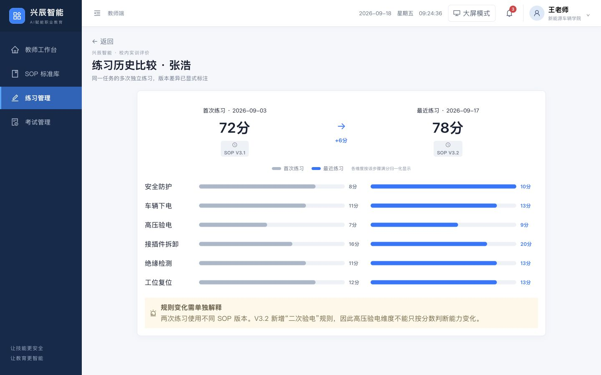
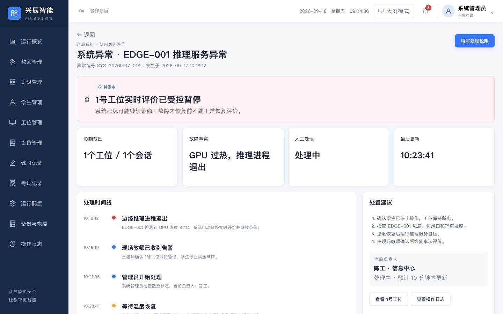
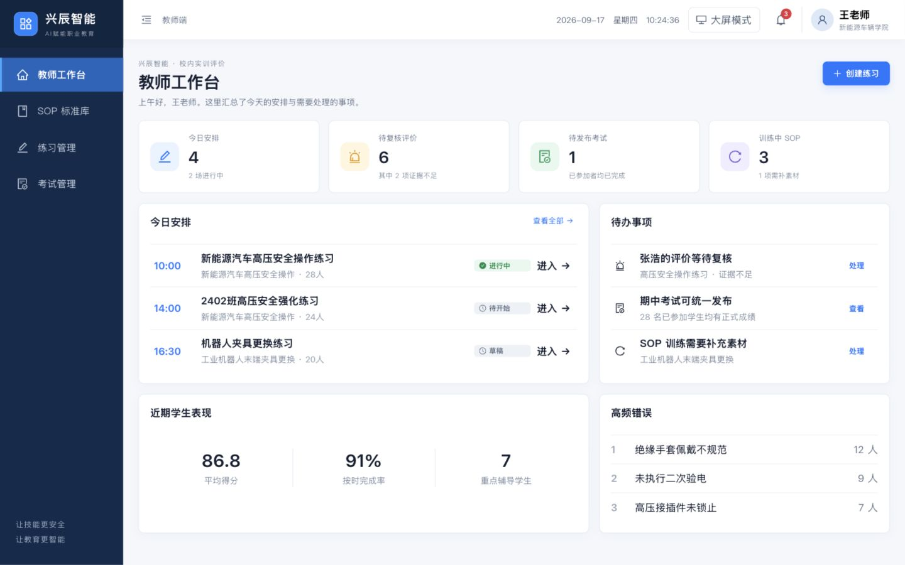
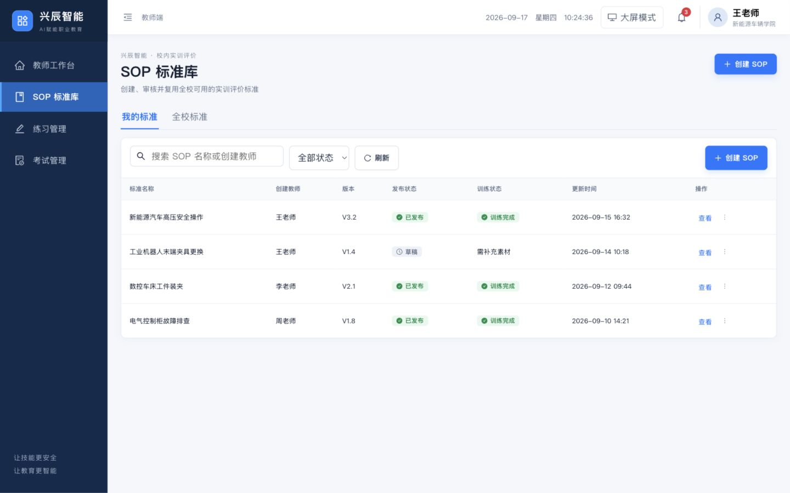
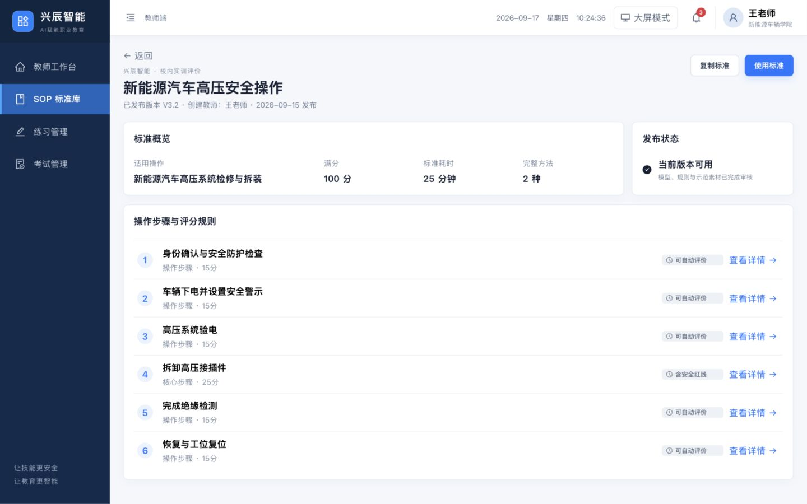
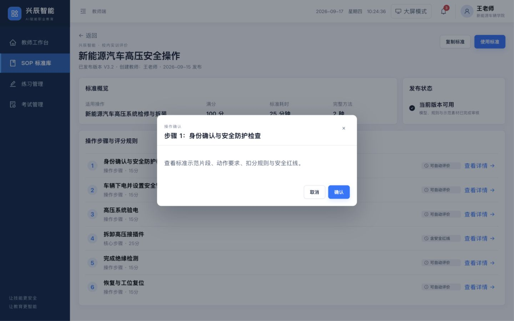
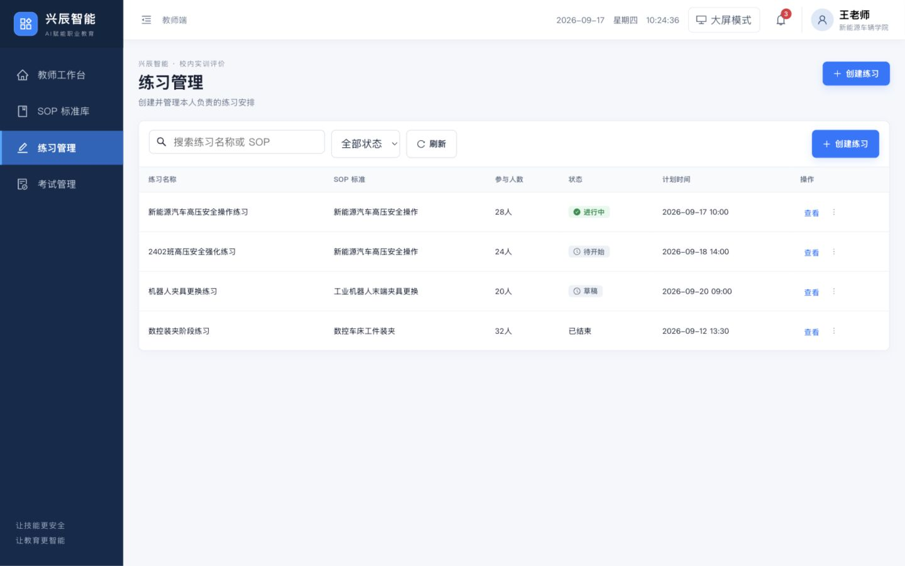
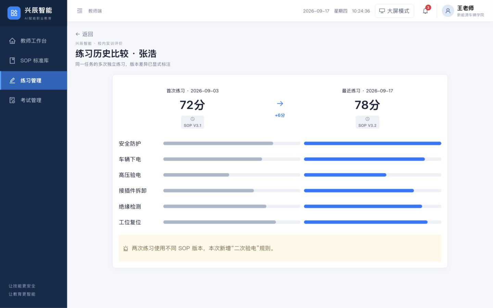
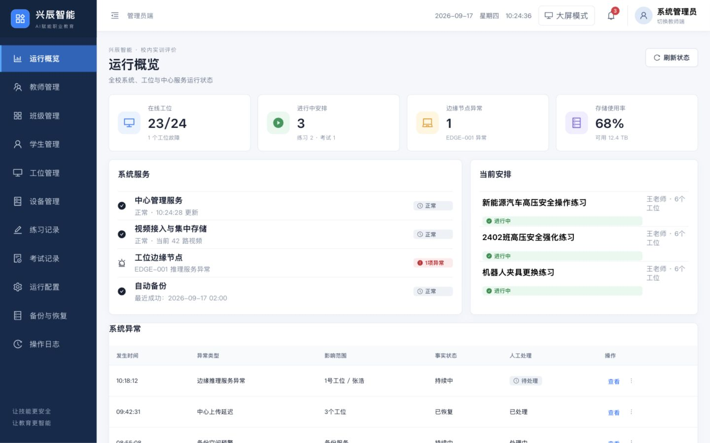
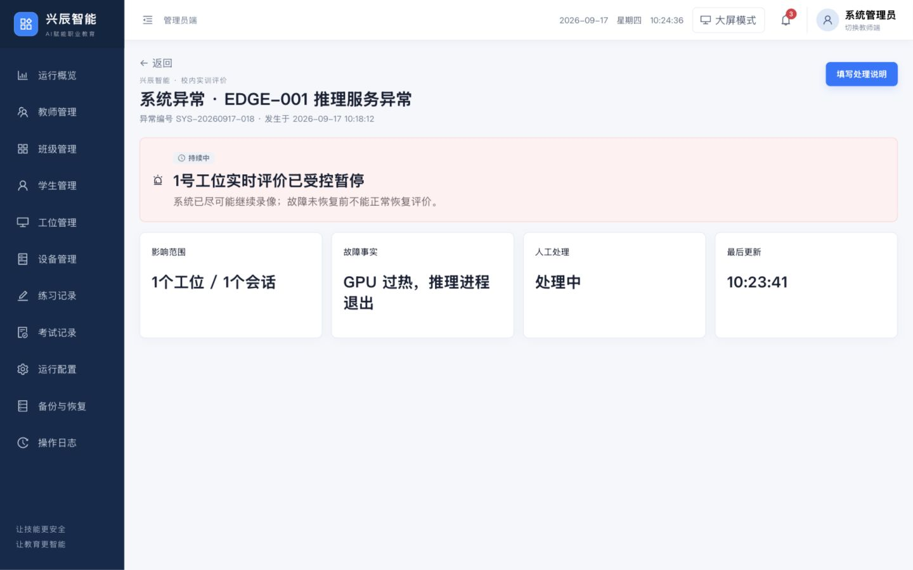

# 兴辰智能产品原型浏览器审查

- 审查日期：2026-09-18
- 范围：教师工作台、SOP 标准库、练习实时监控、学生评价报告、历史比较、管理员运行概览与异常详情
- 浏览器：Codex 内置浏览器
- 视口：默认窄视口（约 828×736）与桌面视口（1440×900）
- 目标：验证教师从查看任务到监控、复核评价的主流程，以及管理员发现并处理系统异常的主流程

## 总体结论

原型的桌面端视觉方向和核心信息架构已经成形，监控页、学生报告和管理员概览尤其接近可评审产品。当前主要风险集中在四处：窄屏不可用、关键“详情”内容仍是占位、人工复核缺少审计信息、角色切换行为不符合用户预期。浏览过程中还捕获到一条 React 内部错误，应在继续扩页前先排查。

## 修复进展（2026-09-18）

- ✅ 827px 宽度下首页不再横向溢出，侧栏可折叠/展开，卡片与主内容完成响应式重排。
- ✅ 修复工位抽屉条件渲染导致的 Hook 顺序错误；回归过程中没有新增 React 错误。
- ✅ SOP 步骤详情已补齐标准动作、采证要求、扣分规则、安全红线和示范素材信息。
- ✅ 人工复核已补齐必填说明、证据归档、分数影响预览与审计记录提示。
- ✅ 头像入口改为明确的身份菜单，切换角色需要点击具名操作。
- ✅ 监控事件栏、历史比较和管理员异常详情已按审查意见补充信息。

### 修复后关键证据

## 最高优先级问题

1. **P1｜窄屏直接横向溢出。** 默认浏览器宽度下，首页右侧内容被截断，侧栏只剩图标且缺少可见的导航文字；小屏笔记本、分屏和内置浏览器场景会阻断使用。
2. **P1｜工位详情抽屉触发 React 内部错误。** 浏览工位详情后，控制台出现 `Internal React error: Expected static flag was missing.`；复查代码后确认是抽屉条件渲染导致 Hook 调用顺序不一致。
3. **P1｜SOP“查看详情”没有提供详情。** 点击步骤后出现的是通用确认框，只重复“查看示范片段、动作要求、扣分规则与安全红线”，没有真正展示这些内容。
4. **P1｜人工复核缺少可追溯信息。** 复核弹窗只有一个结论下拉框，没有理由/备注、证据引用、分数变化预览、操作者与时间记录；对于正式评价，审计链不足。
5. **P1｜用户头像单击即切换角色。** 教师头像看起来是个人菜单入口，但单击后直接进入管理员端，无菜单、无角色说明、无确认，容易造成意外权限与工作上下文切换。

## 体验与可访问性建议

- 监控页右侧事件栏在 1440px 下仍过窄，中文被压成近似逐字换行；应保障 280–320px 可用宽度，并优先显示时间、工位、事件、状态四个关键字段。
- 历史比较只给出无刻度进度条，缺少每项精确分数、差值和图例；同时 SOP 版本变化会干扰“能力进步”的判断，应拆分“表现变化”和“规则变化”。
- 管理员异常详情留白过大，却缺少恢复时间线、处理人、诊断信息、影响对象链接、建议动作和恢复条件。
- 列表页表头和状态层级清楚，但页头与工具栏重复出现“创建 SOP / 创建练习”，可保留一个主入口。
- 多个表格行操作的可访问名称只是“查看”或“more”，读屏用户无法知道对应哪一行；应改为“查看新能源汽车高压安全操作”“更多：新能源汽车高压安全操作”。
- 弹窗关闭按钮的可访问名称是“×”，装饰图标也混入了按钮名称；应为关闭按钮提供“关闭”标签，并隐藏装饰图标的读屏文本。
- 浅灰辅助文字和浅色状态标签存在对比度风险，需要用真实色值做 WCAG 对比度测试。
- 状态同时使用颜色、文字和图标，这是当前可访问性上的优点。

## 审查步骤与证据

### 1. 教师首页（默认窄视口）— 不健康

内容横向溢出，右侧卡片和操作不可见。

### 2. 教师首页（1440×900）— 健康但需收敛

信息层级清楚，今日安排、待办和指标容易扫读；主操作明确。

### 3. SOP 标准库 — 基本健康

检索、筛选、状态和版本信息完整；两个“创建 SOP”入口重复，行操作名称不具备上下文。

### 4. SOP 详情 — 基本健康

步骤、分值和安全红线层级明确，但真正的动作标准与评价依据仍未在页面内展开。

### 5. SOP 步骤弹窗 — 不健康

“查看详情”落到通用确认框，信息量与用户预期不匹配。

### 6. 练习列表 — 基本健康

表格清楚、状态易懂；重复主按钮和缺少行上下文的“查看”是主要问题。

### 7. 实时监控 — 基本健康

工位视频、风险状态和总体进度非常直观；右侧事件栏严重拥挤，关键事件不易快速扫描。

### 8. 工位异常详情 — 健康

抽屉保留了监控上下文，风险、证据和处理入口都很明确，是本轮表现最好的交互之一。

### 9. 学生评价报告 — 健康

得分、步骤、学生证据与标准示范并列，教师能理解扣分来源；信息密度高但仍保持清楚。

### 10. 人工复核弹窗 — 不健康

缺少备注、证据选择、分数变化预览和审计记录，不足以支持正式成绩复核。

### 11. 历史比较 — 需改进

总体进步方向清楚，但每个能力维度没有精确值或差值，版本变化也没有与能力变化分开解释。

### 12. 管理员运行概览 — 基本健康

系统、工位、安排和异常都能在一屏内扫读；教师/管理员角色切换入口不符合预期。

### 13. 管理员异常详情 — 需改进

异常事实简洁，但缺少时间线、负责人、诊断证据、影响对象链接和恢复条件，页面大面积留白。

## 证据限制

- 本轮未执行完整键盘遍历、屏幕阅读器测试、200% 缩放、真实移动设备或正式 WCAG 自动扫描，因此不能据此宣称可访问性合规。
- 本轮覆盖的是教师主流程和管理员异常流程，不等于 34 个页面的逐页验收。
- 未提交会改变评价结果、结束练习或保存管理员处理说明的操作，仅审查了提交前状态。

## 推荐修复顺序

1. 修复窄屏/分屏布局和 React 内部错误。
2. 补齐 SOP 步骤详情与人工复核的证据、备注、分数影响和审计链。
3. 将角色切换改为明确的角色菜单，并保留当前工作上下文提示。
4. 调整监控事件栏、历史比较和管理员异常详情的信息结构。
5. 统一表格行操作的可访问名称、弹窗关闭标签和色彩对比度。
